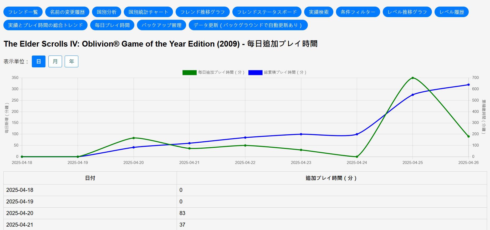
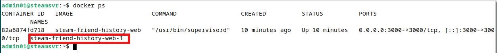
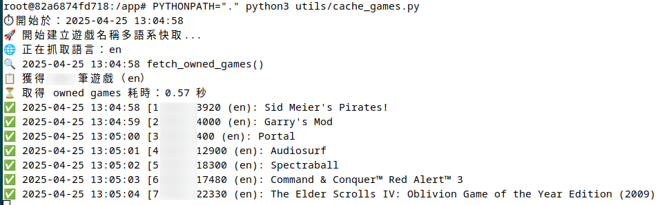
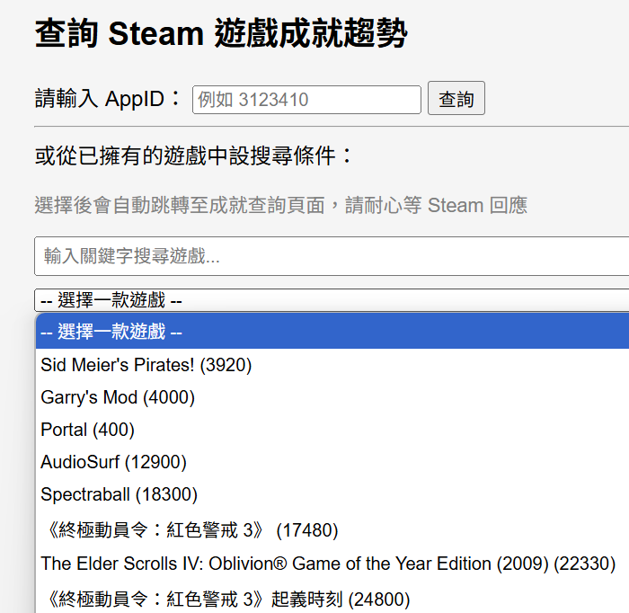
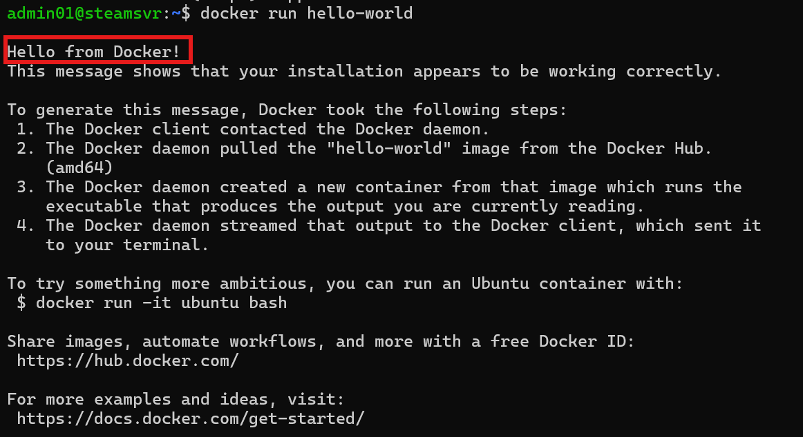

# 🎮 Steam Friend Info（自架版）

一個輕量級、可在 Raspberry Pi 5 或 Linux VM 上運行的 Steam 好友記錄分析系統，使用 Docker 可輕易部署。所有資料皆保存在本地端，無需將 Steam API Key 上傳到第三方服務，適合重視隱私的用戶。

---

## 🌟 系統功能

- ✅ **好友清單變動追蹤**（新增 / 刪除 / 暱稱變更）
- 🌐 **國別統計分析**（人數統計 + 國家分布圖表）
- 🕹️ **成就達成趨勢分析**（支援輸入 AppID 查詢）
- 🔍 **條件篩選器**（國家、有頭像、最近登入天數）
- 📈**等級趨勢圖**
- 📋**等級變化紀錄**
- 📈**成就及遊玩時間總趨勢**
- 📋**遊戲每日遊玩時間**
- 💾 **自動備份 / ZIP 匯出 / 快照保留**
- 🐧 **可執行於 Raspberry Pi 5 / Linux 虛擬機（Debian / Ubuntu）**
- 🐳 **使用 Docker 快速部署，可運行於Raspberry Pi 5 (使用SSD裝置)**
- 🔄 **每日自動快取 Steam 遊戲列表**
  
## ❌ 不支援功能
- 多Steam帳號
- 好友等級資料相關 (只能一個一個抓，太慢)
- 穩私資料如登入 / 登出時間 / 動態牆資料 (Steam api不提供)

---

## ⚙️ 運行環境建議

📢 你可以在以下平台運行此系統：

- ✅ Raspberry Pi 5（建議接 SSD）
- ✅ VMWare / VirtualBox / Hyper-V 等虛擬機上建立的Debian / Ubuntu（建議記憶體 2GB 以上）
- 使用其它種Linux如SUSE、CentOS、RHEL則要自行修改相關設定
- Windows WSL2（不建議，一些設定需額外調整及測試，Windwos環境又特別麻煩，請自己測試）

---

## 💡 補充注意事項

- 你的 Steam 帳號需設為「好友清單」與「遊戲庫公開」，否則資料將無法擷取。
- 若擁有遊戲太多（上千款），快取名稱作業將耗時甚久（Steam API 有頻率限制），系統不會跑太內而動覆執行此動作，但是第一次要等它跑完、寫入後才算成功。
- 快取過後的遊戲名稱不會自動隨 Steam 名稱異動，僅當自動排程或你進系統底層手動下指令更新快取時、才會補上新遊戲。
- 定時自動抓取Steam好友清單；設計上是每1440分鐘更新一次，好友如果太多更新不完可能造成系統報錯，則需要自行調整cron job。時間如果拉太長，只會影響好友名字變更的資料精度、及上線狀況精度。
- 有些資料如遊玩時間、等級走勢、成就總趨勢等，皆必需此程式一直在伺服器或是VM中執行、長期下來才有效果。
- 成就趨勢的圖前期會不太正常，例如你一年前玩了三套遊戲，得到200個成就，在這一年間都沒玩、而裝了此系統後的某一天，你又開它們來玩，在圖上就會看來有幾面個成就。這是因為 Steam api 只回覆最近 14 天玩的遊戲之成就總數。

## 圖例：好友清單

## 圖例：國別分析

## 圖例：好友趨勢圖

## 圖例：變更記錄 
從此對方再怎改，也不會改到認不得娘親

## 圖例：成就達成趨勢圖

### 需要輸入AppID

### 單一遊戲時間資訊 (app要一直開啟執行才能記錄)

---

# 🛠️ 安裝方法 (使用Raspberry Pi 5 8GB版本)

### 1. 安裝 Docker
```bash
cd
curl -sSL https://get.docker.com | sudo sh
sudo usermod -aG docker $USER
newgrp docker
```

### 2. Git Clone 或下載專案
#### 此例為Git clone
```bash
sudo apt update;sudo apt upgrade -y
sudo apt install git -y
cd
git clone https://github.com/bbfox0703/steam-friend-history.git
cd steam-friend-history
cp .env.example .env
vi .env
```

### 3.1 修改 .env 的API KEY及ID
填入Steam API KEY、和Steam帳號的64位元ID 76561xxxxxxxxxxxx  
Steam api key: https://steamcommunity.com/dev/apikey  
**好友列表、遊戲資料如未公開，則無法取得資料且有可能報錯**  

Steam帳號ID:  
開啟你的 Steam 個人檔案（例如：https://steamcommunity.com/id/你的自訂ID 或 https://steamcommunity.com/profiles/數字ID）  
如果是 https://steamcommunity.com/profiles/7656119XXXXXXXXXX  
→ 後面這串就是 SteamID64  
  
或是：  
如果有註冊SteamDB https://steamdb.info/ ，SteamDB個人頁面也有  
  
或是：  
前往網站：https://steamid.io/  
輸入你的 Steam 自訂 ID 或個人頁面網址  
會顯示包括：
- SteamID64 <== 此為要的ID
- SteamID3
- SteamID
- CustomURL 等資訊

### 3.2 修改 docker-compose.yml 的 DNS 設定，請調整成自己環境的設置

### 4. 建立docker映像檔：
```bash
COMPOSE_BAKE=true docker compose build
docker compose up -d
```

### 5. 如要更新repos
```bash
docker compose down
#忽略本地變更：
#git reset --hard
git pull
COMPOSE_BAKE=true docker compose build
docker compose up -d
```

## 完成後、連線網址
http://伺服器ip:3000

例如ip是192.168.1.100的話：
http://192.168.1.100:3000

## 如何手動更新遊戲清單
安裝完後，系統會定期執行遊戲清單更新，如果你裝置的系統不是整天執行，而要取得遊戲清單的話，可手動執行。
### 取得 container name
```bash
docker ps
```

  
### 執行 docker bash
更改 container name 為你系統上的名字
```bash
docker exec -it steam-friend-history-web-1 /bin/bash
cd /app
PYTHONPATH="." python3 utils/cache_games.py --lang all --sleep 1
```
沒問題的話會開始執行  

- 一個遊戲要花約 10~15 秒，第一次執行一定要讓它全跑完，否則不會寫入資料
- 第二次執行時，只更新缺少的部份
- 遊戲名稱如果變更，系統不會跟著改變
遊戲清單更新後用途：在要看成就走勢時，會列出遊戲供選擇，不然就要自行輸入appid

  
  
  
# VMware下 Debian OS 內的安裝方法範例：

### 使用root權限，先把使用者加到 sudo group (例子中帳號為 admin01)：
```bash
su -
usermod -aG sudo admin01
```
  
### 以下使用一般使用者帳號 (有進sudo group) 權限執行 (要重新登入)：
```bash
sudo apt update;sudo apt upgrade -y
sudo apt install open-vm-tools -y
sudo apt install git curl -y
cd
curl -sSL https://get.docker.com | sudo sh
sudo apt-get install -y uidmap
dockerd-rootless-setuptool.sh install
id -u
```
記下輸出數字，例如 1000

```bash
vi .bashrc
```
加入：  
export PATH=/usr/bin:$PATH  
export DOCKER_HOST=unix:///run/user/1000/docker.sock  
  
上面的 1000 是之前 id -u輸出的數字  

```bash
sudo loginctl enable-linger admin01
source ~/.bashrc
```
  
#### 測試 Docker 是否可用
```bash
docker version
docker info
docker run hello-world
```

  
```bash
cd
git clone https://github.com/bbfox0703/steam-friend-history.git
cd steam-friend-history
cp .env.example .env
vi .env
```
### 接上方的 Raspberry Pi 5步驟的 3.1
[跳到該處](#31-修改-env-的api-key及id)
  
  
  
## 部份Docker指令

### 看container狀態
```bash
docker ps
```
>CONTAINER ID   IMAGE                      COMMAND                  CREATED              STATUS              PORTS                                         NAMES
>a32ffd9b20f5   steam-friend-history-web   "/usr/bin/supervisord"   About a minute ago   Up About a minute   0.0.0.0:3000->3000/tcp, [::]:3000->3000/tcp   steam-friend-history-web-1

由上得知container name為steam-friend-history-web-1

### bash進Container：用以上例子
```bash
docker exec -it steam-friend-history-web-1 /bin/bash
```

### cronjob process是否執行
```bash
docker exec steam-friend-history-web-1 sh -c "ps aux | grep cron"
```

### crob jobs 是否 import
```bash
docker exec -it steam-friend-history-web-1 cat /etc/cron.d/steam-friend-cron
```
  
  
## 如何調整好友資料背景更新頻率
修改 cronjob 資料夾下的 steam-friend-cron 第一行:  
\*\/20 代表每20分鐘一次，調整完後存檔、重起 docker  
其它批次工作的時間，也可在這調整
```bash
30 5 * * * root /app/cronjob/update.sh >> /var/log/update.log 2>&1
#*/20 * * * * root /app/cronjob/update.sh >> /var/log/update.log 2>&1
#20 1,4,7,8,23 * * * root /app/cronjob/update.sh >> /var/log/update.log 2>&1
```