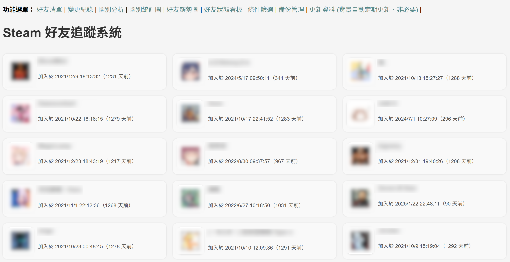

# 目前大部份皆可執行，部份未驗證

# Steam Friend History

一個輕量級、可在Raspberry Pi 5上跑的系統，可記錄自己的Steam好友列表與變化。  
Steam api key可不外流，自己用就好。  
好友列表要公開，不然api抓不到會變空值。  

## 📦 目前功能
- 定時自動抓取 Steam 好友清單
- 網頁界面顯示好友新增與刪除資料；刪除資料要定時抓取才較準
- 好友暱稱變更記錄
- 國別統計與國別分類
- 好友加入趨勢圖
- 好友狀態看板
- 點擊好友可以連到Steam個人頁面
- 使用Docker簡單部署，可運行於Raspberry Pi 5 (使用SSD裝置)



---

## 🛠️ 安裝方法 (Raspberry Pi 5)

### 1. 安裝 Docker
```bash
curl -sSL https://get.docker.com | sudo sh
sudo usermod -aG docker $USER
newgrp docker
```

### 2. Git Clone或下載專案

```bash
git clone https://github.com/bbfox0703/steam-friend-history.git
cd steam-friend-history
cp .env.example .env
vi .env
```

修改 .env的API KEY及ID，填入Steam API KEY、和帳號的64位元ID 76561xxxxxxxxxxxx
Steam api key: https://steamcommunity.com/dev/apikey

建立docker映像檔：
```bash
COMPOSE_BAKE=true docker compose build
docker compose up -d
```

如要更新repos
```bash
docker compose down
git pull
COMPOSE_BAKE=true docker compose build
docker compose up -d
```