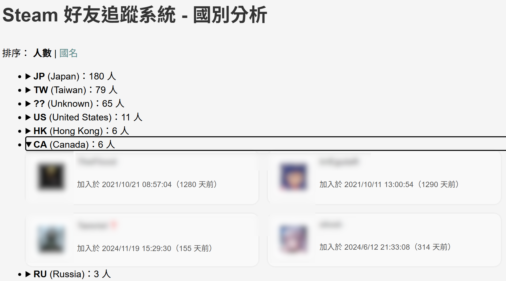
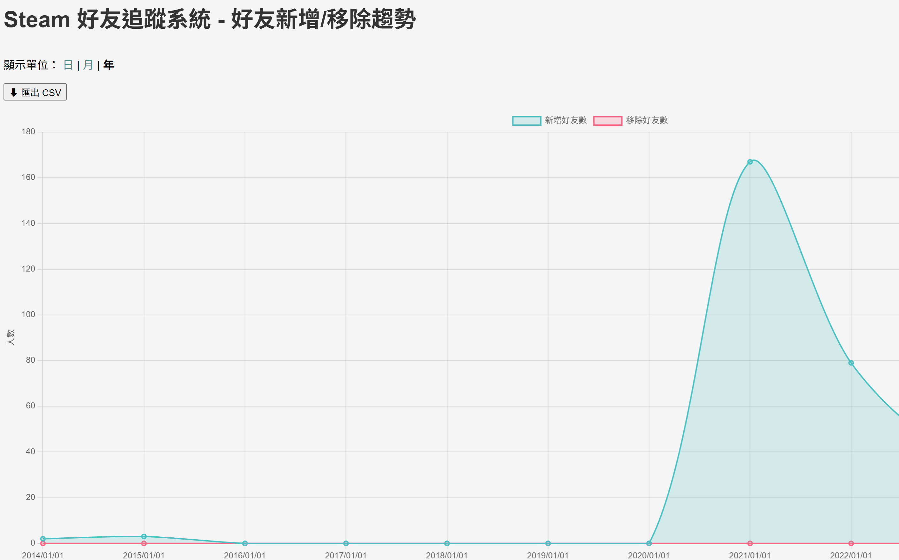
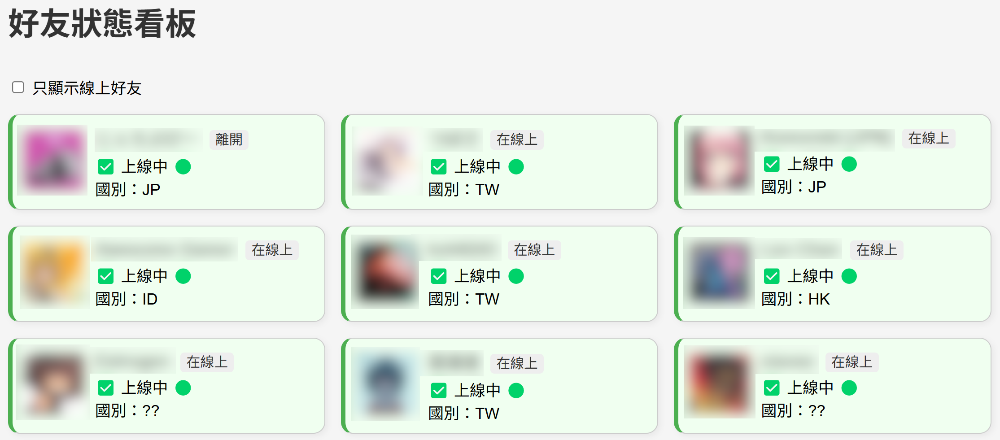
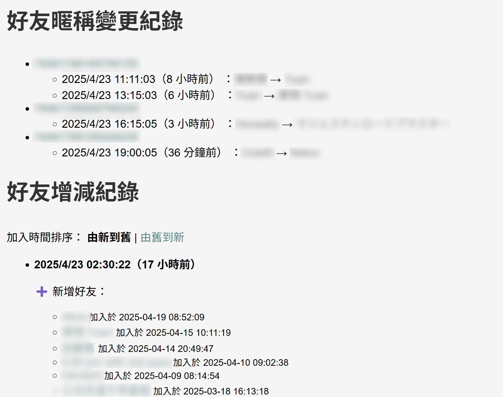
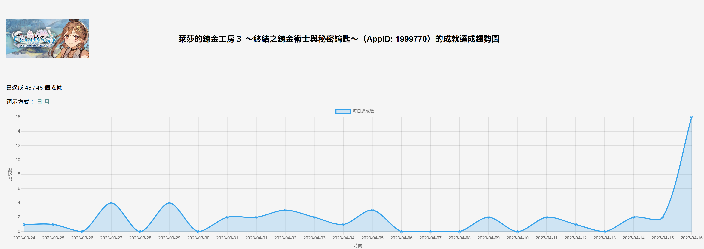
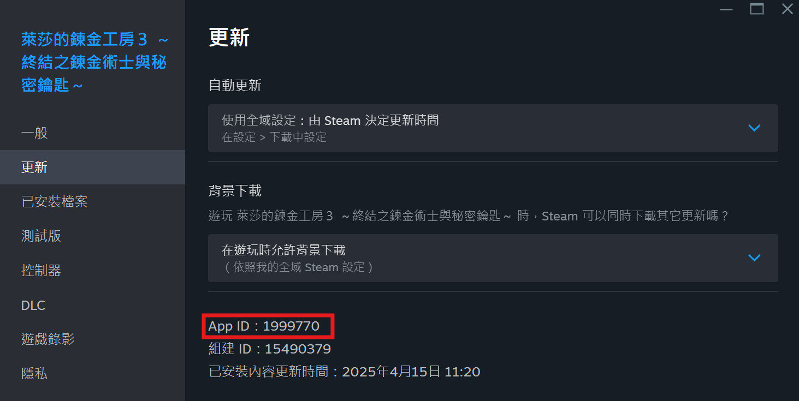
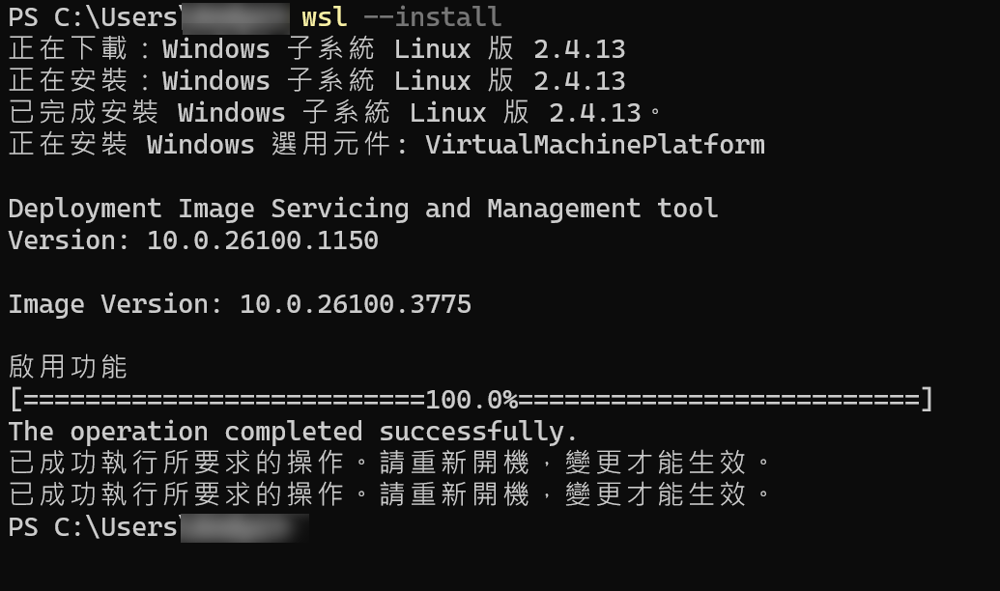

# 目前大部份皆可執行，部份未驗證

# Steam Friend History

一個輕量級、可在Raspberry Pi 5上跑的系統，可記錄自己的Steam好友列表與變化。  
Steam api key可不用外流，自己用就好。  
好友列表要公開，不然api抓不到會變空值。  
持有遊戲如果太多，這應用程式可能不適合你，因為程式在系統時間1:00時、在背景試著執行遊戲名稱預先快取，一個遊戲約需要10~15秒，如果你持有的遊戲很多，可能會一天都跑不完、或者是因api使用太頻繁、會被Steam拒絕存取。一旦第一次執行過後，再來只會處理更新部份，除非資料被刪掉。  

## 📦 目前功能
- 定時自動抓取Steam好友清單
- 網頁界面顯示好友新增與刪除資料 (刪除資料要定時抓取才較準)
- 從App開始定期執行後，記錄好友暱稱變更歷程
- 國別統計與國別分類
- 好友加入趨勢圖
- 好友狀態看板
- 單一遊戲成就達成趨勢圖
- 點擊好友可以連到Steam個人頁面
- **移除記錄功能沒有實際測過**
- 使用Docker簡單部署，可運行於Raspberry Pi 5 (使用SSD裝置)

## 圖例：好友清單

## 圖例：國別分析

## 圖例：好友趨勢圖

## 圖例：好友狀態看板 

## 圖例：變更記錄 
從此對方再怎改，也不會改到認不得娘親

## 圖例：成就達成趨勢圖

### 需要輸入AppID

---

## 🛠️ 安裝方法 (使用Raspberry Pi 5)

### 1. 安裝 Docker
```bash
curl -sSL https://get.docker.com | sudo sh
sudo usermod -aG docker $USER
newgrp docker
```

### 2. Git Clone 或下載專案
#### 此例為Git clone
```bash
git clone https://github.com/bbfox0703/steam-friend-history.git
cd steam-friend-history
cp .env.example .env
vi .env
```

### 3.1 修改 .env 的API KEY及ID，填入Steam API KEY、和Steam帳號的64位元ID 76561xxxxxxxxxxxx
Steam api key: https://steamcommunity.com/dev/apikey  
**好友列表、遊戲資料如未公開，則無法取得資料且有可能報錯**

### 3.2 修改 docker-compose.yml 的 DNS 設定，請調整成自己環境的設置

### 4. 建立docker映像檔：
```bash
COMPOSE_BAKE=true docker compose build
docker compose up -d
```

### 5. 如要更新repos
```bash
docker compose down
#忽略本地變更：
#git reset --hard
git pull
COMPOSE_BAKE=true docker compose build
docker compose up -d
```

## 完成後、連線網址
http://伺服器ip:3000

例如ip是192.168.1.100的話：
http://192.168.1.100:3000

## 🛠️ WSL安裝方法 (不完全步驟 使用Windwos 11 Home)
使用例如VMWare等Hypervisor、直接開VM裝Docker問題最少! 裝個Debian、Ubuntu VM應該都沒問題。  
  
需要安裝：WSL2  
WSL要改的地方不少，例如cron jobs等，還有Python venv問題。  

### WSL2 安裝
使用管理員模式開啟命令提示字元 (cmd.exe)  
輸入：  
```powershell
wsl --install
```

重開機  

### Windows Store 安裝 Debian
確認WSL版本是 v2
```powershell
wsl -l -v
```

#### 執行 Debian
```powershell
wsl
```
  
Linux OS中：
```bash
sudo apt update
sudo apt upgrade -y
sudo apt install git curl procps -y
sudo apt install python3-venv -y
sudo apt install cron -y
sudo service cron start
cd
git clone https://github.com/bbfox0703/steam-friend-history.git
cd steam-friend-history/
cp .env.example .env
```

修改 .env ，填入steam api key & steam id  

```bash
python3 -m venv venv
source venv/bin/activate
pip install -r requirements.txt
python app.py
```
到此網頁應該會起來

### 其它系統定
背景 cronjobs ，請參考steam-friend-cron-wsl、update_wsl.sh、daily_wsl.sh  
如果沒設定背景程式，好友資料和遊戲名稱是不會抓取的，其本上就是整個沒有作用。  
  
  
  
  
## 部份Docker指令

### 看container狀態
```bash
docker ps
```
>CONTAINER ID   IMAGE                      COMMAND                  CREATED              STATUS              PORTS                                         NAMES
>a32ffd9b20f5   steam-friend-history-web   "/usr/bin/supervisord"   About a minute ago   Up About a minute   0.0.0.0:3000->3000/tcp, [::]:3000->3000/tcp   steam-friend-history-web-1

由上得知container name為steam-friend-history-web-1

### bash進Container：用以上例子
```bash
docker exec -it steam-friend-history-web-1 /bin/bash
```

### cronjob process是否執行
```bash
docker exec steam-friend-history-web-1 sh -c "ps aux | grep cron"
```

### crob jobs 是否 import
```bash
docker exec -it steam-friend-history-web-1 cat /etc/cron.d/steam-friend-cron
```