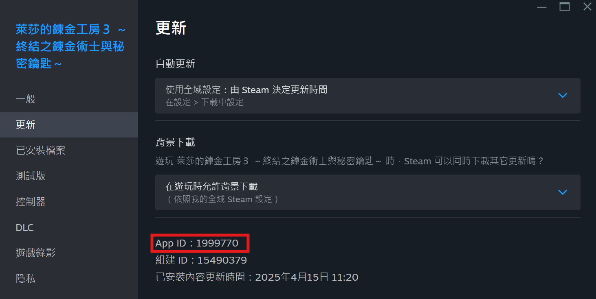

# 🎮 Steam Friend Info（自前ホスト版）

Raspberry Pi 5 または Linux 仮想マシン上で動作する、軽量な Steam フレンド記録分析システムです。Docker を使用して簡単にデプロイ可能。すべてのデータはローカルに保存され、Steam API Key を第三者サービスにアップロードする必要がないため、プライバシーを重視するユーザーに最適です。
  
ウェブインターフェース上のメッセージについては、日本語ブラウザ向けに機械翻訳を適用しておりますが、サーバー側で実行されるバックグラウンドプログラムには適用しておりません。
---

## 🌟 システム機能

- ✅ **フレンドリストの変動追跡**（追加 / 削除 / ニックネーム変更）
- 🌐 **国別統計分析**（人数統計 + 国別分布グラフ）
- 🕹️ **実績達成トレンド分析**（AppID を入力して検索可能）
- 🟢 **フレンドステータスボード**（誰がオンラインか、最終ログイン時間の表示）
- 🔍 **条件フィルター**（国、アイコンあり、最近ログイン日数など）
- 📈 **レベル推移グラフ**
- 📋 **レベル変化履歴**
- 📈 **実績とプレイ時間の総トレンド**
- 📋 **ゲームごとの1日あたりプレイ時間**
- 💾 **自動バックアップ / ZIPエクスポート / スナップショット保存**
- 🐧 **Raspberry Pi 5 / Linux VM（Debian / Ubuntu）で実行可能**
- 🐳 **Docker による高速デプロイ（Raspberry Pi 5 + SSD推奨）**
- 🔄 **Steamゲームリストを毎日自動キャッシュ**

## ❌ 非対応機能
- 複数の Steam アカウント
- フレンドのレベル情報関連（個別取得のみ、非常に遅いため未対応）
- セキュリティ関連情報（ログイン/ログアウト時間、アクティビティウォール情報）（※Steam API が未提供）

---

## ⚙️ 推奨動作環境

📢 以下のプラットフォームで動作確認済み：

- ✅ Raspberry Pi 5（SSD接続推奨）
- ✅ VMWare / VirtualBox / Hyper-V 上に構築した Debian / Ubuntu（メモリ2GB以上推奨）
- その他 Linux（SUSE、CentOS、RHELなど）は個別に設定変更が必要
- Windows WSL2（非推奨、設定調整や動作確認が煩雑なため、自己責任で）

---

## 💡 補足注意事項

- Steam アカウントは「フレンドリスト公開」と「ゲームライブラリ公開」が必要です。非公開の場合、データ取得に失敗します。
- ゲーム所持数が非常に多い場合（数千本以上）、ゲーム名キャッシュ作業に非常に時間がかかります（Steam API にリクエスト制限あり）。初回キャッシュ完了まではシステムがロックされる場合があります。
- キャッシュ後のゲーム名は Steam 上で名称変更されても自動更新されません。再キャッシュまたは手動更新が必要です。
- フレンドリストは10分ごとに自動更新されます。フレンド数が非常に多い場合、cron job 設定を変更する必要があるかもしれません。
- プレイ時間やレベル推移、実績トレンド等は長期間の稼働によって初めて有効になります。
- 実績トレンドグラフは初期段階では正確ではないことがあります。これは Steam API が直近14日間プレイしたゲームしか返却しない仕様によるものです。

## 画面例：フレンドリスト

## 画面例：国別分析

## 画面例：フレンドトレンド

## 画面例：フレンドステータスボード

## 画面例：変更履歴
相手が何度名前を変えても、誰か一目で分かる

## 画面例：実績達成トレンド

### AppIDの入力が必要

### 単一ゲームのプレイ時間情報（常時起動が必要）


---

# 🛠️ インストール方法（Raspberry Pi 5 8GB版）

### 1. Dockerのインストール
```bash
cd
curl -sSL https://get.docker.com | sudo sh
sudo usermod -aG docker $USER
newgrp docker
```

### 2. Git Clone またはプロジェクトをダウンロード
#### Git Cloneの場合
```bash
sudo apt update;sudo apt upgrade -y
sudo apt install git -y
cd
git clone https://github.com/bbfox0703/steam-friend-history.git
cd steam-friend-history
cp .env.example .env
vi .env
```

### 3.1 .env のAPI KEYとIDを修正
Steam API KEY と Steamアカウントの64bit ID（76561xxxxxxxxxxxx）を入力してください。
APIキー取得先：https://steamcommunity.com/dev/apikey

**フレンドリストやゲームデータが非公開だと取得エラーになります。**

ID確認方法：
- SteamプロフィールURL（例：https://steamcommunity.com/profiles/7656119XXXXXXXXXX）→ この数字が SteamID64
- SteamDB（https://steamdb.info/）のプロフィールページ
- https://steamid.io/ にIDまたはURLを入力して確認

### 3.2 docker-compose.yml の DNS設定を自分の環境に合わせて修正

### 4. Dockerイメージビルド
```bash
COMPOSE_BAKE=true docker compose build
docker compose up -d
```

### 5. リポジトリ更新
```bash
docker compose down
#ローカル変更を無視する場合：
#git reset --hard
git pull
COMPOSE_BAKE=true docker compose build
docker compose up -d
```

## インストール完了後のアクセスURL
http://サーバーIPアドレス:3000

例：IPが192.168.1.100なら  
http://192.168.1.100:3000

## 手動でゲームリストを更新する方法

通常は11:05AMに自動更新されますが、手動でも実行可能です。

### コンテナ名の取得
```bash
docker ps
```


### docker bash 実行
コンテナ名を自分の環境に合わせて変更
```bash
docker exec -it steam-friend-history-web-1 /bin/bash
cd /app
PYTHONPATH="." python3 utils/cache_games.py --lang all --sleep 1
```
問題なければゲームキャッシュが開始されます  

- ゲーム1本あたり約10〜15秒かかります
- 初回は必ずすべて完了させる必要があります
- 2回目以降は不足分のみ更新
- ゲーム名変更は自動反映されません

実績トレンドグラフ作成のためにゲームリストが必要です。  


---

# VMware上のDebian OS インストール例

### root権限で、ユーザーをsudoグループに追加（例：admin01）
```bash
su -
usermod -aG sudo admin01
```

### sudo権限の一般ユーザーで作業（再ログイン必要）
```bash
sudo apt update;sudo apt upgrade -y
sudo apt install open-vm-tools -y
sudo apt install git curl -y
cd
curl -sSL https://get.docker.com | sudo sh
sudo apt-get install -y uidmap
dockerd-rootless-setuptool.sh install
id -u
```
出力された数字（例：1000）をメモ

```bash
vi .bashrc
```
以下を追加：  
```bash
export PATH=/usr/bin:$PATH
export DOCKER_HOST=unix:///run/user/1000/docker.sock
```

数字はidコマンドで取得したものに合わせる。

```bash
sudo loginctl enable-linger admin01
source ~/.bashrc
```

### Docker動作確認
```bash
docker version
docker info
docker run hello-world
```


```bash
cd
git clone https://github.com/bbfox0703/steam-friend-history.git
cd steam-friend-history
cp .env.example .env
vi .env
```
### 以降は Raspberry Pi 5 の手順3.1以降に続く  
[こちらにジャンプ](#31-envのapikeyとidを修正)

---

## 一部Dockerコマンド集

### コンテナ状態確認
```bash
docker ps
```

### コンテナにbashで入る
```bash
docker exec -it steam-friend-history-web-1 /bin/bash
```

### cronジョブプロセス確認
```bash
docker exec steam-friend-history-web-1 sh -c "ps aux | grep cron"
```

### cronジョブインポート確認
```bash
docker exec -it steam-friend-history-web-1 cat /etc/cron.d/steam-friend-cron
```

## フレンド情報更新頻度を変更するには

cronジョブファイル `steam-friend-cron` の最初の行を編集して変更します。  
例）`*/10` は10分ごとに実行  
変更後はDocker再起動が必要です。
```bash
*/10 * * * * root /app/cronjob/update.sh >> /var/log/cron_exec.log 2>&1
0 * * * * root echo "✅ Ping cron at $(date)" >> /var/log/cron_exec.log
```
